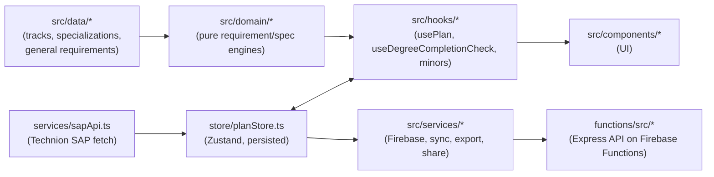

# Codebase Map

A file-level index of `src/` and `functions/src/`, built by static inspection (not a generated
artifact — regenerate by hand if the structure drifts significantly).

**Purpose:** point a future session at the right file directly instead of re-exploring the tree.
Read this before grepping broadly. For *rules and conventions* (not file locations), see the docs
listed in `CLAUDE.md` → Detailed Docs (`store.md`, `domain.md`, `components.md`, `deploy.md`,
`data-sync.md`, `grade-statistics.md`) — this file complements those, it doesn't replace them.

**Queryable alternative:** this file is a static, hand-written summary. For a live, queryable
graph of the actual code (dependency edges, "what calls X", shortest path between two symbols),
see `graphify-out/graph.json` / `graphify-out/GRAPH_REPORT.md` and the `## Codebase Graph
(graphify)` section in `CLAUDE.md`. Re-run `graphify update . --code-only` after nontrivial
changes to keep it in sync; this markdown file should be updated by hand if the directory
structure itself changes.

## Architecture flow

Rule of thumb: `domain/` is pure (no store, no React) and does the actual requirement math;
`hooks/` is the bridge that reads the store, calls into `domain/`, and returns React-friendly
results; `components/` renders what hooks give it; `services/` handles anything crossing a
network/storage boundary (Firebase, SAP fetch, export files, sharing).

## `src/domain/` — requirement + specialization engines (pure, no store/React access)

Top-level files:
- `ceProjectRequirements.ts` — CE track's mandatory/elective credit split, depends on which project courses (EE vs CS-style) the student placed. `getCeProjectRequirementProfile`, `isCeCsProjectCourse`.
- `containingCourse.ts` — "מכיל" (containing-course) substitution: a taken course that SAP marks as containing a mandatory course fills that course's slot. `computeContainingSubstitutions`, `buildContainingMaps`.
- `downstreamDependents.ts` — reverse-prerequisite graph queries. `getDownstreamDependents`, `getPostponeSlack`, `isCourseRelevantToTrack`.
- `electives.ts` — elective-credit area classification (ee/physics/math/general) and split allocation. `getTrackElectivePolicy`, `allocateElectiveCredits`, `resolveElectiveCreditArea`.
- `noAdditionalCredit.ts` — "ללא זיכוי נוסף" (no double credit) conflict detection between overlapping courses. `computeNoAdditionalCreditConflicts`.
- `resolveTrack.ts` — applies per-entry-year track variant overrides. `resolveTrackForYear`.
- `staticCourseDiagnostics.ts` — dev-time check for static course-ID references missing from the SAP catalog.

`degreeCompletion/` — course→bucket assignment + requirement checklist + recommendations:
- `engine.ts` — `computeDegreeCompletionCheck(...)`, orchestrates the rest of this folder. Its one cross-layer dependency: calls `hooks/usePlan.ts`'s `computeRequirementsProgress`.
- `helpers.ts` — bucket-assignment machinery (`buildCourseAssignments`, `buildRequirementChecks`), independently decoupled from `usePlan.ts`.
- `optimizer.ts` — `suggestChainAssignments`, `suggestMissingCourses`, `suggestTrackScheduleCourses` (recommendation heuristics).
- `types.ts` — `DegreeBucket`, `DegreeRequirementCheck`, `DegreeCompletionResult`.

`generalRequirements/` — university-wide requirements (sport/MELAG/labs/English/general electives):
- `matchers.ts` — `matchCourse(course, matcher)`, generic pure rule-matcher.
- `rulesEngine.ts` — `calculateRequirement`, `calculateGeneralRequirements`.
- `specialAllocation.ts` — choir/orchestra/sports-team credit allocation tables.
- `electivesAllocator.ts` — pours sport/MELAG/external-faculty credits into sub-buckets.
- `progressBuilder.ts` — `buildGeneralRequirementsProgress(...)`, the entry point this whole subfolder builds toward.
- `types.ts` — `GeneralRequirementRule`, `GeneralRequirementProgress`, etc. (rules for these types are in `docs/domain.md`).

`gradeStatistics/` — CheeseFork/technion-histograms grade data (dataset docs: `docs/grade-statistics.md`):
- `types.ts`, `parse.ts` (defensive JSON parser), `select.ts` (`resolveStatistic`), `semester.ts` (semester-code compare/format), `filters.ts` (`computeVisibleCourses` — the filter→sort→limit pipeline for the catalog UI), `index.ts` (barrel).

`specializations/` — "שרשראות התמחות" JSON parsing + rule evaluation:
- `engine.ts` (~1260 lines) — parses raw specialization JSON into typed `SpecializationGroup`s, evaluates progress. `evaluateSpecializationGroup`, `buildTrackSpecializationCatalogs`.
- `catalog.ts` — loads per-track specialization JSON via `import.meta.glob`, caches. `getTrackSpecializationCatalog`.

## `src/hooks/`

- `usePlan.ts` (1136 lines, the central module) — `usePrerequisiteStatus`, `useWeightedAverage`, `computeRequirementsProgress` (the core pure function, ~650 lines — mandatory/elective/total/general/lab/core/specialization/English/minor progress), `useRequirementsProgress` (store-subscribed wrapper), `useChainRecommendations`.
- `useDegreeCompletionCheck.ts` — store-subscribed hook wrapping `domain/degreeCompletion`.
- `useGeneralRequirements.ts` — barrel re-export of `domain/generalRequirements/progressBuilder`.
- `useEntrepreneurshipMinor.ts`, `useQuantumComputingMinor.ts`, `useRoboticsMinor.ts` — one progress-calculator hook per minor, each reads its own `src/data/*Minor.ts` rules.

## `src/services/`

- `apiClient.ts` — fetch wrapper for the Functions API (multi-base-URL fallback, auth-token attach + 401 retry).
- `cheesefork.ts` — CheeseFork Firestore-REST feedback fetch, semester formatting, instructor-name clustering. Self-contained (raw `fetch`, no other internal deps).
- `cloudSync.ts` — Firestore plan document read/write, `subscribeToCloudPlan` (handles legacy flat-plan → envelope migration).
- `firebase.ts` — Firebase app/auth/firestore init from `VITE_FIREBASE_*` env vars. Exports `auth`, `db`.
- `gradeStatistics.ts` — loads `public/grade-statistics.json`, builds the index consumed by `domain/gradeStatistics`.
- `planExport.ts` — JSON/CSV export + import parsing for the whole plan.
- `planStateSerialization.ts` — deep-clones/defaults store state into a plain serializable `StudentPlan`.
- `planSync.ts` — envelope construction/comparison + conflict resolution (`shouldApplyCloudEnvelope`) for cloud sync.
- `planValidation.ts` — client-side strict allowlist sanitizer for `StudentPlan`/envelope payloads. Mirrored server-side by `functions/src/security/planValidation.ts` — keep both in sync when either changes.
- `sapApi.ts` — fetches + merges Technion SAP course data across semesters, applies legacy-course/credit-override fixups. `fetchCourses()`.
- `shareApi.ts` / `shareRouting.ts` — share CRUD via `apiClient` + Firestore listeners; `parseShareHash` for `#/share/<id>` URLs.

## `src/context/`

- `AuthContext.tsx` — Google-popup Firebase Auth provider, `useAuth()`, Hebrew error-message mapping.
- `ShareModeContext.tsx` — carries share-viewing state (canEdit/isOwner/isShareReview) to components under a `/share/:id` link.

## `src/types/`

- `index.ts` (326 lines) — the central domain type module and leaf dependency for nearly everything else: `TrackDefinition`, `SapCourse`, the specialization type family, `StudentPlan` (the full persisted plan shape), `VersionedPlanEnvelope`.
- `share.ts` — `ShareDoc`, `CreateSharePayload/Response`, `GetShareResponse`.

## `src/utils/`

- `courseGrades.ts` — repeatable-course grade-key handling, `computeWeightedAverage`.
- `courseNumberNormalize.ts` — Technion course-number format conversion (6/7/8-digit ↔ SAP `0XXX0XXX`).
- `faculty.ts` — deterministic faculty→color-badge mapping.
- `occurrenceId.ts` — the `courseId~N` occurrence-ID scheme for repeatable courses placed multiple times.
- `pdfTextExtractor.ts` — pdf.js-based line extraction for transcript import.
- `semesterGridCollision.ts` — dnd-kit custom collision detection for the semester grid.
- `subjects.ts` — course-ID-prefix → subject classification for catalog filtering.
- `teachingSemester.ts` — winter/spring-only course badge.
- `transcriptImport.ts` / `transcriptParser.ts` — Optigrade-ported PDF transcript → grades/semesters parsing.
- `versionComparison.ts` — plan-version diff helpers for the comparison UI.

## `src/store/planStore.ts` (1570 lines)

Full persistence rules live in `docs/store.md`. Export-surface inventory only:
- Constants: `NORMAL_VERSION_LIMIT` (4), `INTERNAL_VERSION_LIMIT` (6), `MAX_SEMESTERS` (16).
- Track/catalog: `setTrack`, `setCatalogYear`, `switchCatalogYear`, `beginTrackSwitch`/`finishTrackSwitch`.
- Course placement: `addCourseToSemester`, `removeCourseFromSemester`, `moveCourse`, `toggleCompleted(Instance)`.
- Specializations: `toggleSpecialization`, `toggleDoubleSpecialization`, `setCoreToChainOverrides`, `setCourseChainAssignment`.
- Grades/electives: `setGrade`, `setBinaryPass`, `setElectiveCreditAssignment`, `setNoAdditionalCreditOverride`.
- Semester structure: `addSemester`, `addSummerSemester`, `removeSemester(Summer)`, `reorderSemesters`, `setTargetGraduationSemesterId`.
- Requirement toggles: `toggleEnglishExemption`, `setEnglishScore`, `toggleMelagCourse`, `toggleRoboticsMinor`/`toggleEntrepreneurshipMinor`/`toggleQuantumComputingMinor`.
- Plan lifecycle: `loadPlan`, `loadEnvelope`, `resetPlan`, `resetToDefault`, `undo`.
- Versioning: `createVersion`, `switchVersion`, `renameVersion`, `deleteVersion`.
- Share review: `loadShareReviewEnvelope`, `clearShareReview`, `copyShareReviewToEditableVersion`.
- Cloud sync bookkeeping: `markCloudSyncPending`, `markCloudSyncSettled`.

## `src/data/`

- `tracks/{ee,cs,ce,ee_math,ee_physics,ee_combined}.ts` + `tracks/index.ts` — per-track `TrackDefinition` (mandatory schedule, credit targets). `tracks/semesterSchedule.ts` — shared schedule helpers.
- `specializations/{ee,cs,ce,ee_math,ee_physics,ee_combined}_specializations.ts` — raw specialization-group source data consumed by `domain/specializations/catalog.ts`.
- `generalRequirements/` — **script-generated, do not hand-edit** (`courseClassification.ts`, `generalRules.ts`, `generatedCourseLists.ts` — regenerate via `npm run sync:general-requirements`).
- `entrepreneurshipMinor.ts`, `quantumComputingMinor.ts`, `roboticsMinor.ts` — per-minor rule tables, each paired with its `hooks/use*Minor.ts`.
- `externalFacultyElectives.ts` — external-faculty elective course list + credit cap, consumed by `domain/electives.ts`.
- `teachingSemesterFallback.ts` — winter/spring-availability overrides for courses SAP doesn't classify cleanly.
- `historicalCourses.ts` — thin lazy-load shim; real legacy course data is dynamically imported by `services/sapApi.ts`.
- `degreeRules.json` — misc static degree-rule constants.

## `src/components/` (8.8k lines total — largest files listed first for the heavy hitters)

Full RTL/Tailwind conventions are in `docs/components.md`. One-liners for files not already named there:

- `RequirementsPanel.tsx` (1443 lines, largest) — renders `computeRequirementsProgress` output; mandatory/elective/lab/core/English/minor breakdown.
- `ExportShareModal.tsx` (814) — JSON/CSV export + share-link creation UI, wraps `services/planExport.ts` + `services/shareApi.ts`.
- `CourseDetailModal.tsx` (736) — prerequisites, manual prereq-path selection, substitutions, grades, SAP deep link, CheeseFork summary.
- `SemesterGrid.tsx` (639) — top-level dnd-kit board (see `docs/components.md`).
- `CheeseForkInfo.tsx` (630) — CheeseFork review aggregate display, instructor clustering UI over `services/cheesefork.ts`.
- `CourseSearch.tsx` (502) — fast search by name/number, favorites, quick-add.
- `CourseCard.tsx` (411) — draggable course card (see `docs/components.md`).
- `DegreeCompletionModal.tsx` (407) — renders `useDegreeCompletionCheck` bucket/requirement results.
- `SpecializationGroupModal.tsx` (348) — single specialization group's rule detail + course picker.
- `PrintView.tsx` (346) — print-friendly plan layout.
- `CourseFilterPanel.tsx` (325) — subject/grade-stat/teaching-semester filter controls for `CourseSearch`.
- `SemesterColumn.tsx` (310) — one semester's drop target + warnings (see `docs/components.md`).
- `VersionCompareModal.tsx` (297) — side-by-side plan version diff, uses `utils/versionComparison.ts`.
- `SpecializationPanel.tsx` (225) — elective specialization selector (see `docs/components.md`).
- `BucketView.tsx` (217) — degree-completion bucket list view.
- `ShareModeWrapper.tsx` (211) — top-level wrapper when the app is opened via a `/share/:id` link; wires `ShareModeContext`.
- `GradeSheetModal.tsx` (180) — bulk grade-entry table.
- `VersionTabs.tsx` (148) — plan version tab switcher, launches `VersionCompareModal`.
- `ChainRecommendations.tsx` (131) — specialization-chain suggestions (from `domain/degreeCompletion/optimizer.ts`).
- `CourseGradeStats.tsx` (110) — single-course grade histogram, uses `domain/gradeStatistics`.
- `LoginButton.tsx` (97) — Google/Microsoft sign-in button, uses `AuthContext`.
- `DegreePlanningMenu.tsx` (88) — "initialize recommended plan" / "start from scratch" entry menu.
- `TrackSelector.tsx` (83) — track picker.
- `MobileSidebarDrawer.tsx` (51) — mobile slide-out nav wrapper.
- `Toast.tsx` (18) — small notification banner.

## `functions/src/` — Firebase Cloud Functions backend (Express)

- `index.ts` — mounts `plansRouter`/`adminRouter`/`aiRouter`/`sharesRouter` under `/` and `/api`, applies `securityHeadersMiddleware` + `corsMiddleware` globally. Exports the single `api` https function.

`middleware/`:
- `auth.ts` — `verifyAuth`, Firebase ID-token verification, 401 on failure, attaches `req.uid`.
- `optionalAuth.ts` — same but never 401s; sets `uid`/`email` to `null` on missing/invalid token.
- `adminCheck.ts` — `requireAdmin`, checks `req.uid` against `ADMIN_UIDS` env var. Must run after `verifyAuth`.

`routes/`:
- `admin.ts` — `GET /stats`, `GET /users`, `GET /plans/:uid`, `DELETE /users/:uid`. Chain: auth → rate-limit(60/min) → admin-check.
- `ai.ts` — `POST /recommend`. Chain: auth → rate-limit(15/min). Currently backed by a stub (`services/aiService.ts`).
- `plans.ts` — `GET /`, `POST /` (own plan only). Chain: auth → rate-limit(120/min).
- `shares.ts` — `POST /` (create), `GET /:id` (optional-auth, always-200 with reason codes), `PUT /:id`, `PATCH /:id/meta`. TTL allowlist: 1d/3d/1w/30d/120d/365d only.

`security/`:
- `http.ts` — CORS allowlist, strict security headers (CSP `default-src 'none'`), in-memory per-identity rate limiter factory.
- `planValidation.ts` — server-side mirror of `src/services/planValidation.ts` (functions/ is a separate TS project, so this is independently duplicated — keep both in sync).

`services/`:
- `aiService.ts` — `getAiRecommendations`, currently a stub (scaffolding for future LLM-backed recommendations).
- `firestoreService.ts` — Firestore/Admin-Auth wrappers: `getPlan`, `savePlan`, `deletePlan`, `listAllUsers`, `deleteUser` (cascades), `getStats`.
- `sharesService.ts` — Firestore CRUD for the `shares` collection, `generateShareId`.
